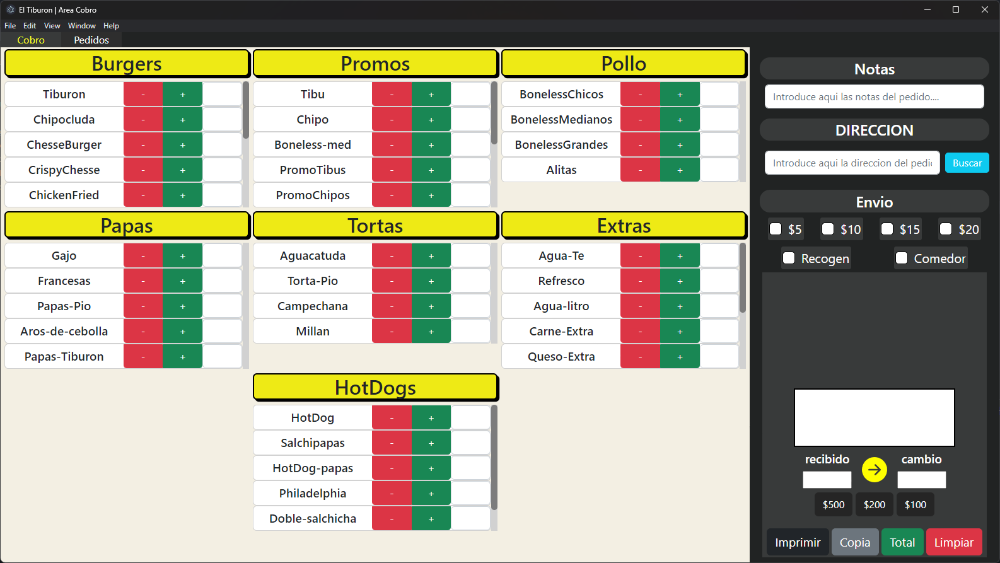

# Punto De Venta De **El Tiburon Burger**

## made with **ELECTRON JS**

``` js
class Author{
  author = "ManuelsSaNt"
}
```



So, my family have`s a Burger restaurant, and they need a "sell point" or desktop app to take  
orders and calculate the total price of an order, so I make one version on python with PySide6 but  
the compatibility with thermal printers are disguising, so I say, fuc* bro im a web developer
and Node.js exist so, Electron!!!, and I make this electron-app that uses electron-pos-printer
to use my thermal printer and run good.

Electron it's a bit confusing at the start but is a great framework with much to learn so

you can download the code or send me a DM to try to help you if you needed.

thanks for reed this!!!
